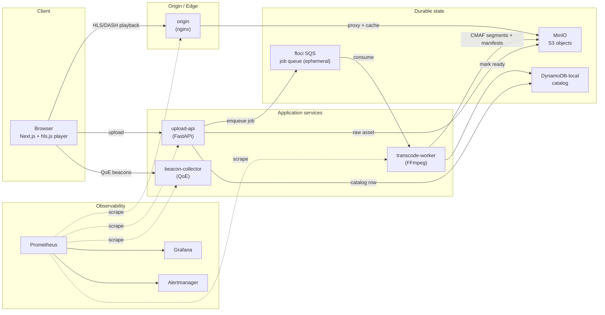
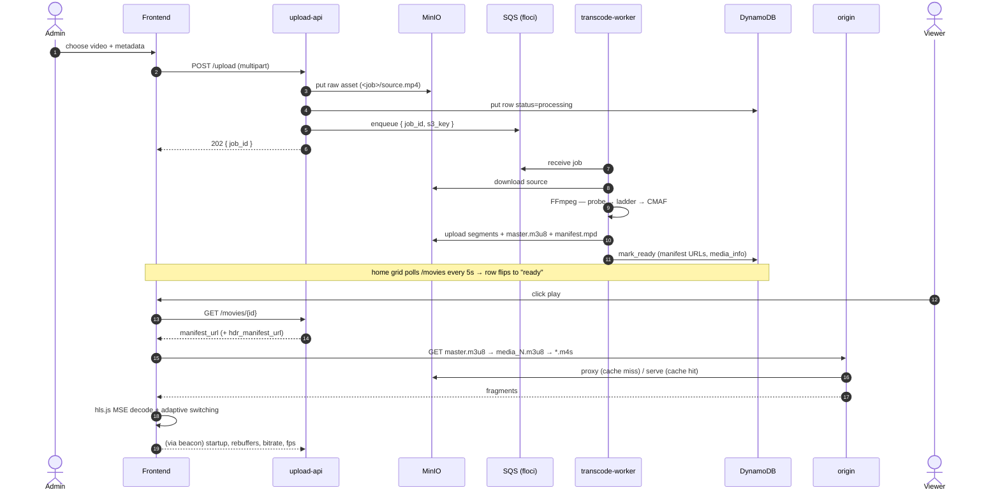
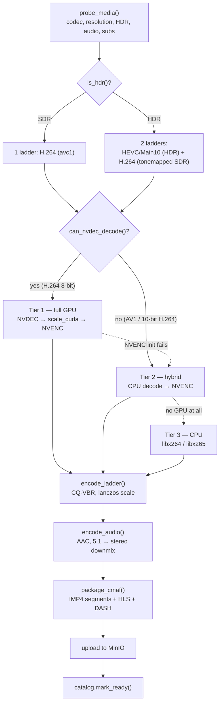
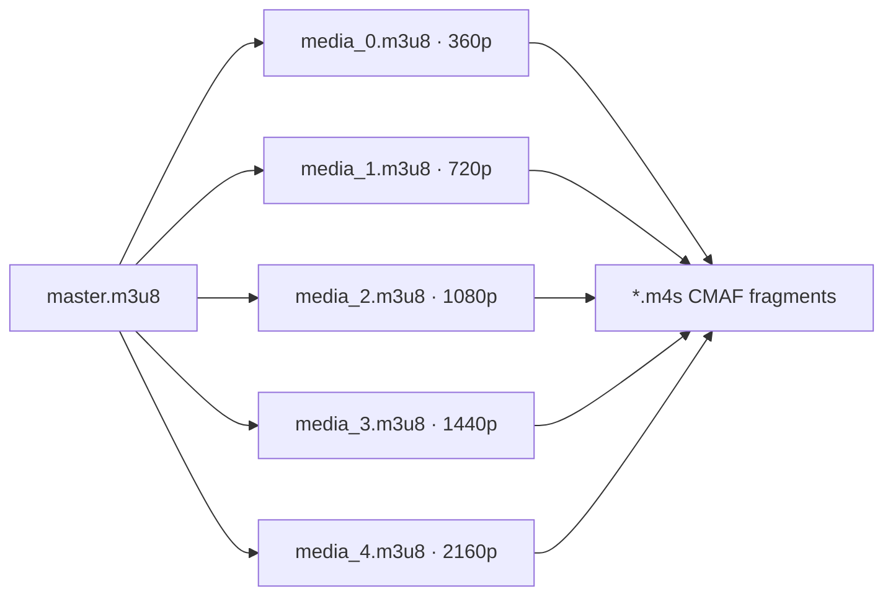
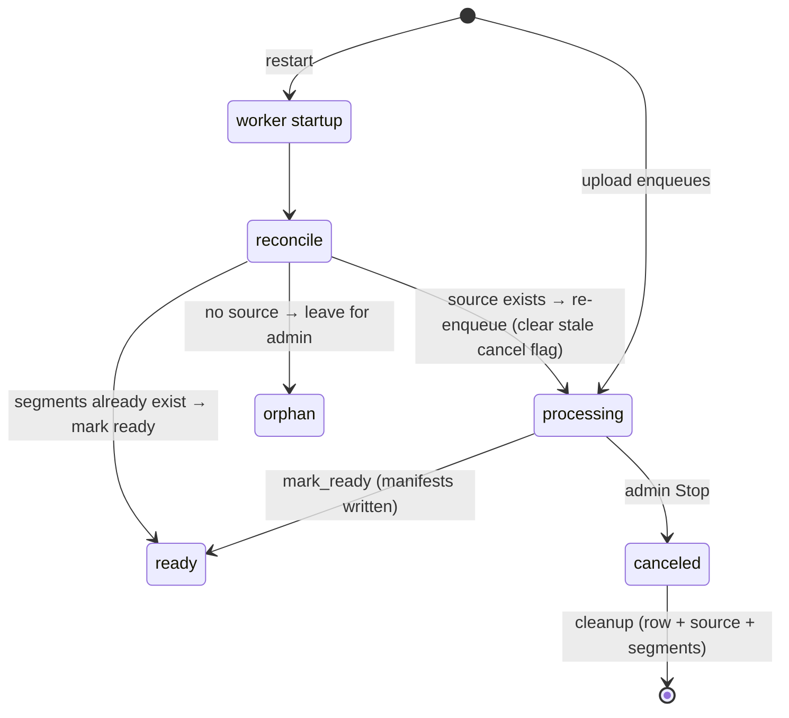

# 🎬 StreamSRE — Mini Video Streaming Platform + SRE

**An end-to-end OTT streaming stack** (upload → GPU transcode → CMAF packaging → HLS/DASH → adaptive web player)
**built to demonstrate production SRE**: SLOs, error budgets, burn-rate alerting, self-healing, and QoE telemetry.

`Apple-TV-style player` · `FFmpeg + NVENC/NVDEC` · `HLS + MPEG-DASH from one encode` · `HDR/HEVC + SDR/H.264` · `Prometheus + Grafana`


---

## Table of contents

1. [What this is](#1-what-this-is)
2. [Screenshots](#2-screenshots)
3. [System architecture](#3-system-architecture)
4. [Components & ports](#4-components--ports)
5. [End-to-end data flow](#5-end-to-end-data-flow)
6. [Storage & durability model](#6-storage--durability-model)
7. [The transcode pipeline (deep dive)](#7-the-transcode-pipeline-deep-dive)
8. [The bitrate ladder](#8-the-bitrate-ladder)
9. [HLS vs DASH & adaptive bitrate](#9-hls-vs-dash--adaptive-bitrate)
10. [CMAF: one encode, two protocols](#10-cmaf-one-encode-two-protocols)
11. [The player & QoE](#11-the-player--qoe)
12. [Admin studio & self-healing](#12-admin-studio--self-healing)
13. [Observability & SRE](#13-observability--sre)
14. [📐 Mathematics appendix](#14--mathematics-appendix)
15. [API reference](#15-api-reference)
16. [Local development](#16-local-development)
17. [Repository structure](#17-repository-structure)
18. [Roadmap](#18-roadmap)

---

## 1. What this is

StreamSRE mimics a modern streaming service (Apple TV / Netflix) **and** the operational
machinery a real SRE team runs behind it. A video you upload is stored, transcoded on the
GPU into an adaptive bitrate ladder, packaged **once** into CMAF fragments that serve **both**
HLS and DASH, and streamed to a custom player that measures its own Quality-of-Experience.

It is designed so you can walk an interviewer through:

- **The delivery path** — exactly how a byte of video travels from `POST /upload` to a decoded frame on screen.
- **The reliability story** — the SLOs, the error budget math, and the multi-window burn-rate alerts that page someone.
- **The failure story** — how the system *self-heals* jobs orphaned by an infrastructure restart, and how you'd debug a stuck upload with metrics + logs + runbooks.

**Highlights**

| Capability | What it does |
|---|---|
| **GPU transcode** | FFmpeg with a 3-tier NVENC/NVDEC → hybrid → CPU fallback ladder |
| **Adaptive streaming** | HLS (`master.m3u8`) + MPEG-DASH (`manifest.mpd`) from the *same* CMAF segments |
| **HDR + SDR dual codec** | HEVC/Main10 (`master_hevc.m3u8`) for HDR-capable browsers, H.264 for everyone else |
| **Capability-based selection** | Player uses `navigator.mediaCapabilities` to pick a codec it can *actually* decode |
| **Self-healing** | Worker startup reconciler recovers jobs whose queue message was lost on restart |
| **QoE telemetry** | Startup time, rebuffering, bitrate switches, live FPS + dropped frames → beacon collector |
| **SRE stack** | Prometheus + Alertmanager + Grafana with SLO dashboards & burn-rate alerts |

---

## 2. Screenshots

> Drop PNGs into [`docs/images/`](docs/images/) with the filenames below and they'll render here.

| | |
|---|---|
| **Home — Apple-TV-style catalog** | **Player with live QoE overlay** |
|  |  |
| **Admin studio — dashboard + catalog** | **Grafana — SLO & burn-rate dashboard** |
|  |  |

---

## 3. System architecture



**The one-sentence version:** `upload-api` accepts a file and drops a job on the queue; the
`transcode-worker` turns it into an adaptive ladder in object storage; `origin` serves those
segments; the player streams them adaptively and reports how well it went.

---

## 4. Components & ports

| Service | Container | Host port | Role |
|---|---|---:|---|
| **Web player** | `streamsre-frontend` | `3001` | Next.js 15 app-router UI, `hls.js` playback, admin studio |
| **Upload API** | `streamsre-upload-api` | `8000` | FastAPI: accept uploads, write catalog, enqueue jobs, admin edits |
| **Transcode worker** | `streamsre-transcode-worker` | *(internal `9100`)* | FFmpeg encode ladder + CMAF packaging + reconciler |
| **Origin** | `streamsre-origin` | `8080` | nginx: serve/cache manifests & segments, CORS + cache policy |
| **Beacon collector** | `streamsre-beacon-collector` | `8001` | Ingest QoE telemetry from the player |
| **MinIO** | `streamsre-minio` | `9000` / `9001` | S3-compatible object storage + web console |
| **DynamoDB-local** | `streamsre-dynamodb` | *(internal `8000`)* | Movie catalog (metadata + job status) |
| **floci** | *(own stack)* | `4566` | Local AWS emulator — used here **only for SQS** |
| **Prometheus** | `streamsre-prometheus` | `9090` | Metrics scraping + recording/alert rules |
| **Grafana** | `streamsre-grafana` | `3000` | Dashboards (origin, transcode, QoE, SLOs) |
| **Alertmanager** | `streamsre-alertmanager` | `9093` | Routes burn-rate alerts |

---

## 5. End-to-end data flow



---

## 6. Storage & durability model

A deliberate split — **the data that must survive a restart is persistent; only the queue is ephemeral.**

| Store | Backing | Persistent? | Holds |
|---|---|:--:|---|
| **Object storage** | MinIO (`minio_data` volume) | ✅ | raw uploads + HLS/DASH segments + custom artwork |
| **Catalog** | DynamoDB-local (`dynamo_data` volume) | ✅ | title metadata, visibility, job status, manifest URLs, `media_info` |
| **Job queue** | floci SQS | ❌ (in-memory) | transcode job messages |

Because the queue is the *only* ephemeral piece, a restart mid-transcode can strand a catalog row
in `processing` with its job message gone. Rather than fight that, the worker **reconciles on
startup** (see [§12](#12-admin-studio--self-healing)) — the durable stores are the source of truth,
and the queue is treated as a disposable cache of pending work.

> Two buckets: `streamsre-raw-uploads` (sources) and `streamsre-hls-segments` (packaged output + posters).
> Browse them live in the MinIO console at `http://localhost:9001`.

---

## 7. The transcode pipeline (deep dive)

One FFmpeg invocation does a **single decode** and fans out to every rung of the ladder. The route
through the GPU depends on what the source is and what the hardware can actually decode.



**Key mechanisms**

- **3-tier GPU fallback.** Full-GPU (`NVDEC → scale_cuda → NVENC`) is fastest, but a GTX 1650 (Turing)
  has **no AV1 NVDEC** and NVDEC H.264 is 8-bit-only. `can_nvdec_decode()` detects AV1 / 10-bit-H.264
  sources up front and skips the doomed full-GPU attempt (saving ~90 s/job of failing retries),
  dropping to hybrid (CPU decode + NVENC) or pure CPU.
- **Width-class ladder.** A "4K" trailer letterboxed to 2560×1350 is only 1350 tall but is really a
  1440p-class picture. The ladder is chosen by an **effective height** so wide sources aren't
  under-rendered — see the [math](#14--mathematics-appendix).
- **Aspect-preserving scale.** Every rung uses `force_original_aspect_ratio=decrease:force_divisible_by=2`
  so nothing is stretched, and only sub-360p sources are ever upscaled (to keep a playable floor).
- **Dual codec for HDR.** HDR titles get an HEVC/Main10 ladder (`hvc1.2.4.L153.B0`) **and** a
  tonemapped H.264 ladder (via a `zscale → tonemap=hable → zscale` chain), published as two masters.
- **Audio.** 5.1 (6-channel) AAC breaks browser MSE in demuxed HLS, so audio is downmixed to stereo (`-ac 2`).

See [`docs/transcode-pipeline.md`](docs/transcode-pipeline.md) for the exact FFmpeg command construction.

---

## 8. The bitrate ladder

Rungs actually encoded (from [`services/transcode-worker/app/profiles.py`](services/transcode-worker/app/profiles.py)).
The ladder never upscales: a 1080p source stops at 1080p; a 4K source yields the whole ladder.

| Rung | Resolution | Video bitrate | Max rate | Buffer | H.264 profile | Example codec string* |
|---|---|---:|---:|---:|---|---|
| 360p  | 640×360   | 800 kbps  | 856 kbps  | 1.2 Mb | main | `avc1.4d401f` |
| 720p  | 1280×720  | 2.5 Mbps  | 2.68 Mbps | 3.75 Mb| main | `avc1.4d4020` |
| 1080p | 1920×1080 | 5 Mbps    | 5.35 Mbps | 7.5 Mb | high | `avc1.4d402a` |
| 1440p | 2560×1440 | 12 Mbps   | 12.84 Mbps| 18 Mb  | high | `avc1.4d4033` |
| 2160p | 3840×2160 | 24 Mbps   | 25.68 Mbps| 36 Mb  | high | `avc1.4d4034` |

<sub>*Codec strings taken from a real generated `master.m3u8`. HDR titles additionally publish an HEVC ladder tagged `hvc1.2.4.L153.B0`.</sub>

Quality uses **constant-quality VBR** (`-rc vbr -cq N -b:v 0 -preset p7 -tune hq`, plus AQ / lookahead /
multipass for H.264) rather than fixed bitrate — bits go where the picture needs them, capped by `maxrate`.

---

## 9. HLS vs DASH & adaptive bitrate

Both protocols are generated; the player uses **HLS** via `hls.js` (MSE) with native HLS on Safari.

| | **HLS** | **MPEG-DASH** |
|---|---|---|
| Manifest | `master.m3u8` (+ `media_N.m3u8`) | `manifest.mpd` |
| Origin | Apple | MPEG / ISO standard |
| Segments | **shared CMAF fMP4** | **shared CMAF fMP4** |
| Player here | `hls.js` (+ native Safari) | dash.js-compatible (served, not default) |
| Segment MIME | `video/iso.segment` | `video/iso.segment` |

**How the player picks a rung.** `hls.js` keeps an EWMA estimate of throughput and chooses the highest
rung whose bitrate fits under a safety fraction of it — formalized in the [math appendix](#14--mathematics-appendix).
A rung switch fires a `bitrate_switch` QoE beacon.



---

## 10. CMAF: one encode, two protocols

The worker packages video into **CMAF** (fragmented MP4). HLS and DASH manifests both *point at the same
`.m4s` fragments* — so you store one copy of the media, not one per protocol. For a title with renditions
$R$, duration $D$ and per-rung bitrate $b_r$:

$$
S_{\text{naive}} = \underbrace{\sum_{r\in R}\frac{b_r D}{8}}_{\text{HLS copy}} + \underbrace{\sum_{r\in R}\frac{b_r D}{8}}_{\text{DASH copy}}
\qquad\text{vs.}\qquad
S_{\text{CMAF}} = \sum_{r\in R}\frac{b_r D}{8}
$$

i.e. CMAF halves streaming storage relative to packaging each protocol separately:
$\;S_{\text{CMAF}} = \tfrac{1}{2} S_{\text{naive}}$.

---

## 11. The player & QoE

A custom React player (`frontend/components/player/VideoPlayer.tsx`) built on `hls.js`:

- **Capability-based codec choice.** Chrome will *claim* it supports HEVC via `isTypeSupported` and then
  fail to decode; the player instead calls `navigator.mediaCapabilities.decodingInfo` and only uses the
  HDR/HEVC master when it reports `supported && smooth`, else falls back to H.264.
- **Live QoE overlay** (the gauge button): quality (`Auto · 1080p`), **frame rate (measured)**, bitrate,
  startup ms, buffer seconds, rebuffers, **dropped frames**.
- **Real FPS measurement** via `requestVideoFrameCallback` (counts frames the compositor actually
  presents), with a decode-stats fallback for Firefox.
- **IMAX fill mode.** Cinematic trailers bake ~2.39:1 black bars *into* the 16:9 frame, so `object-fit`
  can't remove them. The player samples the current frame to a tiny canvas, detects the real content
  rectangle, and zooms so it fills the screen — [math here](#14--mathematics-appendix).

QoE events are batched and sent to the beacon collector via `navigator.sendBeacon` (survives page unload):

| Event | When | Payload |
|---|---|---|
| `startup` | first frame renders | `startup_ms` |
| `rebuffer` | a stall resolves | `rebuffer_ms` |
| `bitrate_switch` | rung change | `current_bitrate_kbps` |
| `heartbeat` | every 15 s while playing | `current_bitrate_kbps` |
| `error` | fatal hls.js error | `error_type` |

---

## 12. Admin studio & self-healing

**Admin studio** (`/admin`): upload, plus a per-title editor with no re-upload required —
edit metadata, replace poster/backdrop (custom artwork survives a re-transcode), set visibility
(`draft` / `unlisted` / `published`), re-transcode, or delete. A dashboard strip summarizes
Titles / Ready / Processing / Published with live progress bars.

**Self-healing reconciler.** Because the SQS queue is ephemeral ([§6](#6-storage--durability-model)),
a restart can orphan a job. On boot the worker scans the catalog for `processing` rows and repairs each:



Hardening that came out of a real incident in this repo:

- `list_all` **skips malformed rows** so one bad row can't 500 the whole catalog.
- Worker writes are guarded with `attribute_exists(id)` so a progress update can't **resurrect a
  deleted row** as a partial phantom.
- The reconciler **clears a stale `cancel_requested`** before re-enqueue, so a leftover cancel flag
  can't kill (and delete the source of) a freshly recovered job.

---

## 13. Observability & SRE

Prometheus scrapes every service; Grafana renders origin latency/errors, transcode queue depth &
failures, and QoE; Alertmanager routes the pages. Artifacts live in [`slo/`](slo/),
[`runbooks/`](runbooks/), and [`chaos/`](chaos/).

**SLOs (illustrative)**

| SLO | Target | Error budget (30 d) |
|---|---:|---:|
| Playback start success | 99.9% | 43.2 min |
| Origin availability | 99.95% | 21.6 min |
| Transcode job success | 99.0% | 7.2 h |

**Error budget & burn rate.** For an SLO $s$, the budget is $E = 1-s$. If the current error rate is
$e$, the **burn rate** is $BR = e/(1-s)$ — how many times faster than "sustainable" you're spending
budget. Multi-window burn-rate alerting pages only when a fast window *and* a slow window both burn hot,
which catches real outages while ignoring blips (see the [math](#14--mathematics-appendix)).

**Chaos.** Kill the origin or inject latency (`chaos/`) and watch the burn-rate alerts fire and the
runbook in [`runbooks/`](runbooks/) drive the response.

---

## 14. 📐 Mathematics appendix

**Width-class effective height** (ladder selection for letterboxed sources), where $w_s,h_s$ are source width/height:

$$
H_{\text{eff}} = \max\!\left(h_s,\ \left\lceil w_s \cdot \tfrac{9}{16}\right\rceil\right)
\qquad\Rightarrow\qquad
\text{ladder} = \{\,r : \text{height}(r) \le H_{\text{eff}}\,\}
$$

**Segment count** for VOD of duration $D$ with target segment length $\tau$:

$$N_{\text{seg}} = \left\lceil D / \tau \right\rceil$$

**Storage per title** with rung bitrates $b_r$:

$$S = \sum_{r \in R} \frac{b_r \cdot D}{8}\ \text{bytes}$$

**Adaptive bitrate selection.** With EWMA throughput estimate $\hat B_t = \alpha B_t + (1-\alpha)\hat B_{t-1}$
and safety factor $\gamma \in (0,1]$ (≈0.7–0.8), the chosen rung is the richest one that still fits:

$$r^\star = \max\{\, r \in R : b_r \le \gamma\,\hat B_t \,\}$$

**Rebuffering ratio** — the headline QoE number ($T_{\text{stall}}$ = time spent buffering, $T_{\text{play}}$ = time playing):

$$\text{RB} = \frac{T_{\text{stall}}}{T_{\text{stall}} + T_{\text{play}}}$$

**Error budget & burn rate** for SLO $s$ and observed error rate $e$:

$$E = 1 - s \qquad\qquad BR = \frac{e}{1-s}$$

A multi-window/multi-burn-rate alert fires when a short window $W_s$ and long window $W_l$ both exceed a
threshold burn rate $\theta$ (e.g. $\theta=14.4$ over 1 h burns a 30-day budget in ~2 days):

$$\text{page} \iff \big(BR_{W_s} > \theta\big) \wedge \big(BR_{W_l} > \theta\big)$$

**Queue behaviour (Little's Law).** With job arrival rate $\lambda$ and mean processing time $W$, the
steady-state queue depth is $L = \lambda W$ — the number Grafana's "queue depth" panel should hover near.

**IMAX fill zoom.** With frame $f_w\times f_h$, player box $b_w\times b_h$, and detected content
rectangle $c_w\times c_h$, the `object-contain` scale is $s=\min(b_w/f_w,\ b_h/f_h)$ and the zoom that
makes the content cover the box is:

$$Z = \max\!\left(\frac{b_w}{c_w\,s},\ \frac{b_h}{c_h\,s}\right)$$

---

## 15. API reference

Base: `http://localhost:8000/api/v1` · Admin endpoints use HTTP Basic (`ADMIN_USERNAME`/`ADMIN_PASSWORD`).

| Method | Path | Auth | Purpose |
|---|---|:--:|---|
| `POST` | `/upload` | 🔒 | Upload a video → store + enqueue transcode |
| `GET` | `/movies/` | — | List catalog (skips malformed rows) |
| `GET` | `/movies/{id}` | — | One title (manifest URLs, media_info) |
| `PATCH` | `/movies/{id}` | 🔒 | Edit metadata / visibility / poster reset |
| `POST` | `/movies/{id}/artwork?kind=poster\|backdrop` | 🔒 | Upload custom artwork |
| `POST` | `/movies/{id}/retranscode` | 🔒 | Re-run from stored source (409 if gone) |
| `DELETE` | `/movies/{id}` | 🔒 | Delete row + segments + source |
| `GET` | `/jobs/{id}` | — | Transcode job status/progress |
| `POST` | `/jobs/{id}/cancel` | 🔒 | Cooperatively cancel a running job |
| `POST` | `/beacon/` *(:8001)* | — | Ingest a batch of QoE events |

**Playback URLs** (via origin `:8080`): `GET /hls/<id>/master.m3u8` (H.264),
`/hls/<id>/master_hevc.m3u8` (HDR), `/hls/<id>/manifest.mpd` (DASH).

---

## 16. Local development

Everything runs in Docker Compose. Object storage (MinIO), the catalog (DynamoDB-local) and their
buckets/tables are created automatically on `up` — **no Terraform apply is needed for local dev.**

**One command:**

```bash
./start.sh            # bring up the whole stack   (--seed pushes a demo clip)
./stop.sh             # stop services              (./stop.sh --all also stops floci)
```

**Or with the Makefile / compose directly:**

```bash
make up               # docker compose up: storage + services + observability
# GPU transcoding (NVENC/NVDEC) overlay:
docker compose -f docker-compose.yml -f docker-compose.gpu.yml up -d
bash scripts/seed-test-video.sh   # push a test clip through the pipeline
```

Then:

- **Browse & watch** — `http://localhost:3001`
- **Admin studio** — `http://localhost:3001/admin` (default `admin`/`admin`). Uploads transcode to
  HLS+DASH and appear on the grid within a few seconds (it auto-refreshes).
- **Play directly** — `http://localhost:8080/hls/<job>/master.m3u8` (HLS) or `.../manifest.mpd` (DASH)
- **Objects** — MinIO console `http://localhost:9001`
- **Metrics & alerts** — Grafana `http://localhost:3000`, Prometheus `http://localhost:9090`
- **Chaos** — scripts in `chaos/` kill origin / inject latency; watch burn-rate alerts fire

If an upload stays **"Processing"**, run `bash scripts/diagnose.sh` — it dumps the worker logs plus the
live S3 / SQS / DynamoDB state to show why. (The worker also self-heals stuck jobs on its next restart.)

---

## 17. Repository structure

```
video-streaming-sre/
├── services/
│   ├── upload-api/          # FastAPI: uploads, catalog, admin edits, enqueue
│   ├── transcode-worker/    # FFmpeg encode ladder + CMAF packaging + reconciler
│   │   └── app/
│   │       ├── transcoder.py  # ladder/HDR/GPU-fallback command construction
│   │       ├── profiles.py    # the bitrate ladder
│   │       ├── catalog.py     # DynamoDB writes (guarded)
│   │       └── main.py        # SQS loop + startup reconciler
│   ├── origin/              # nginx origin: serve/cache manifests + segments
│   └── beacon-collector/    # QoE telemetry ingest
├── frontend/                # Next.js 15 player UI + admin studio (hls.js)
├── infra/terraform/         # IaC for cloud S3/SQS (reference; not run for local dev)
├── observability/           # Prometheus, Grafana, Alertmanager configs + dashboards
├── slo/ · runbooks/ · chaos/  # SRE artifacts
├── security/                # image + secret scanning
├── docs/                    # architecture, product, database, api, transcode-pipeline, infra-floci
├── docker-compose.yml       # base stack
├── docker-compose.gpu.yml   # NVENC/NVDEC GPU overlay
└── start.sh · stop.sh · Makefile
```

Deeper docs: [`docs/architecture.md`](docs/architecture.md) ·
[`docs/transcode-pipeline.md`](docs/transcode-pipeline.md) ·
[`docs/design.md`](docs/design.md) ·
[`docs/infra-floci.md`](docs/infra-floci.md).

---

## 18. Roadmap

- [x] Persistent storage (MinIO + DynamoDB) surviving restarts
- [x] GPU transcode with 3-tier fallback + AV1/10-bit detection
- [x] Dual HDR (HEVC) + SDR (H.264) ladders with client capability selection
- [x] Per-title admin studio + dashboard + self-healing reconciler
- [x] Live FPS / dropped-frame QoE
- [ ] Real auth (JWT / RBAC / audit log) in place of HTTP Basic
- [ ] Admin QoE/observability dashboard sourced from the beacon collector
- [ ] Viewer accounts: resume / continue-watching / My List
- [ ] Durable queue (move SQS off the in-memory emulator)
- [ ] Cloud deploy (ECS + CloudFront)

<div align="center"><sub>Built as an SRE portfolio project — local-first, GPU-accelerated, and instrumented end to end.</sub></div>
