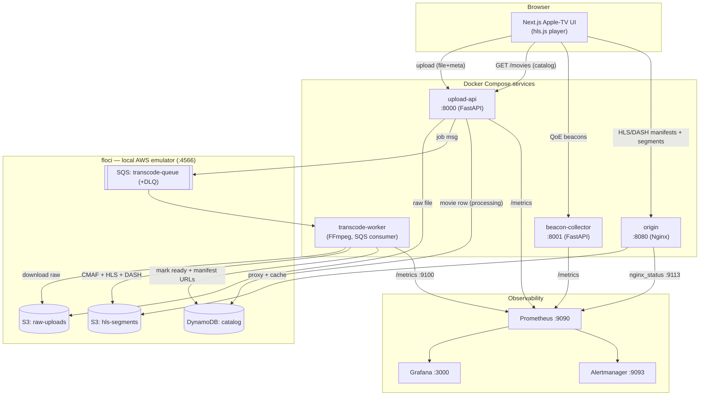

# Architecture — Mini Video Streaming Platform + SRE

This document describes the **system as it is actually built**: the components,
how a request flows through them, where AWS is emulated locally by **floci**,
and where the SRE/observability hooks attach.

For the full narrative design (goals, data model, decisions), see
[design.md](design.md). For endpoints, see [api-structure.md](api-structure.md).
For the Terraform + floci story, see [infra-floci.md](infra-floci.md).

---

## 1. High-level diagram

---

## 2. Components

| Component | Tech | Port(s) | Responsibility |
|---|---|---|---|
| **Web player** (`frontend/`) | Next.js 14, React, hls.js, Tailwind | 3001 | Apple-TV–style catalog UI; uploads; HLS playback; QoE beacons |
| **Upload API** (`services/upload-api`) | Python 3.12, FastAPI | 8000 | Validate + store uploads (S3), enqueue transcode (SQS), own the catalog (DynamoDB), job status |
| **Transcode Worker** (`services/transcode-worker`) | Python + FFmpeg | 9100 (metrics) | Consume SQS, one FFmpeg pass → CMAF + HLS + DASH, upload to segments bucket, mark catalog ready |
| **Origin** (`services/origin`) | Nginx | 8080, 9113 (metrics) | Proxy + cache manifests/segments from the S3 segments bucket; CDN-edge stand-in |
| **Beacon Collector** (`services/beacon-collector`) | Python 3.12, FastAPI | 8001 | Ingest player QoE events → Prometheus metrics |
| **Prometheus** | Prometheus | 9090 | Scrape metrics; evaluate recording + alert rules |
| **Grafana** | Grafana | 3000 | Dashboards (backend, pipeline, QoE, SLOs) |
| **Alertmanager** | Alertmanager | 9093 | Route/dedupe alerts |
| **floci** (external stack) | floci binary | 4566 | Local AWS emulator: S3, SQS, DynamoDB |

**AWS resources (in floci, provisioned by Terraform):**

| Resource | Name | Used by |
|---|---|---|
| S3 bucket | `streamsre-raw-uploads` | upload-api (write), worker (read) |
| S3 bucket | `streamsre-hls-segments` | worker (write), origin (read) |
| SQS queue (+DLQ) | `streamsre-transcode-queue` | upload-api (send), worker (receive) |
| DynamoDB table | `streamsre-catalog` | upload-api (CRUD), worker (update status) |

---

## 3. Data flows

### 3.1 Upload → transcode → ready

1. UI `POST /api/v1/upload` (multipart: file + optional title/genre/year/…).
2. **upload-api**: validates → puts raw file to `raw-uploads` → writes a
   DynamoDB catalog row with `status=processing` (the **movie id is the job id**)
   → enqueues an SQS message `{job_id, s3_key}`.
3. **transcode-worker**: receives the job, downloads the raw file, runs **one**
   FFmpeg pass producing CMAF (fMP4) segments plus `master.m3u8` (HLS) and
   `manifest.mpd` (DASH), uploads everything to `hls-segments/<job_id>/`, then
   updates the DynamoDB row to `status=ready` with the manifest URLs.
4. UI polls `GET /api/v1/jobs/{job_id}` (S3-derived: complete once
   `master.m3u8` exists) and/or re-fetches the catalog.

### 3.2 Playback

1. UI `GET /api/v1/movies/` renders the hero + genre rows.
2. Click **Play** → navigate to `/player?url=<manifest_url>`.
3. hls.js requests `master.m3u8` → media playlists → `.m4s` segments, all via
   the **origin** (`:8080/hls/...`), which proxies and caches the S3 segments
   bucket. DASH players can use `manifest.mpd` from the same segments.

### 3.3 Telemetry (QoE)

1. The player measures startup time, rebuffering, bitrate switches, errors.
2. It `POST`s batches to **beacon-collector** `POST /api/v1/beacon/`.
3. The collector converts events into Prometheus metrics (startup histogram,
   rebuffer counters, session counters), scraped by Prometheus.

---

## 4. Local AWS: floci + Terraform

- **floci** runs as its own stack (`~/floci-stack`), listening on
  `http://localhost:4566` and speaking the real AWS wire protocol. It replaces
  what would be AWS (or LocalStack) in dev — no code changes, just the endpoint.
- **Terraform** (`infra/terraform`) provisions the S3 buckets, SQS queues, and
  DynamoDB table **into floci** (path-style S3, dummy creds, `:4566` endpoints).
- Containers reach floci at `host.docker.internal:4566`; host tools (Terraform,
  AWS CLI) use `localhost:4566`.
- As a fallback, every service **lazily self-creates** its resource on first use,
  so the stack works even if `terraform apply` is skipped.

See [infra-floci.md](infra-floci.md) for full details and the real→prod mapping.

---

## 5. SRE & observability anchors

- **Golden signals** per service: latency, traffic, errors, saturation.
- **Metrics**: `upload_api_http_*` (upload-api), transcode job duration / queue
  depth / segments uploaded (worker, `:9100`), `qoe_*` (beacon), nginx stub
  status (origin, `:9113`).
- **SLOs / burn-rate alerts** (`slo/`, `observability/prometheus/rules`):
  manifest/segment availability + latency, transcode success, QoE startup and
  rebuffer ratio; multi-window fast/slow burn.
- **Runbooks** (`runbooks/`): high manifest error rate, transcode queue backup /
  DLQ, origin 5xx spikes.
- **Chaos** (`chaos/`): kill origin, inject latency — prove the alerts + SLOs.

---

## 6. Deployment mapping (local → cloud)

Everything here is designed to lift onto real AWS by swapping the floci endpoint
for real service endpoints:

| Local (this repo) | Real AWS |
|---|---|
| floci S3 | S3 |
| floci SQS | SQS |
| floci DynamoDB | DynamoDB |
| Nginx origin | S3 + CloudFront (OAC) |
| Docker Compose | ECS Fargate / EKS |
| Prometheus + Grafana | Amazon Managed Prometheus/Grafana or CloudWatch |
| Terraform → floci | Same Terraform → AWS (drop the `endpoints{}`/skip_* in `provider.tf`) |
