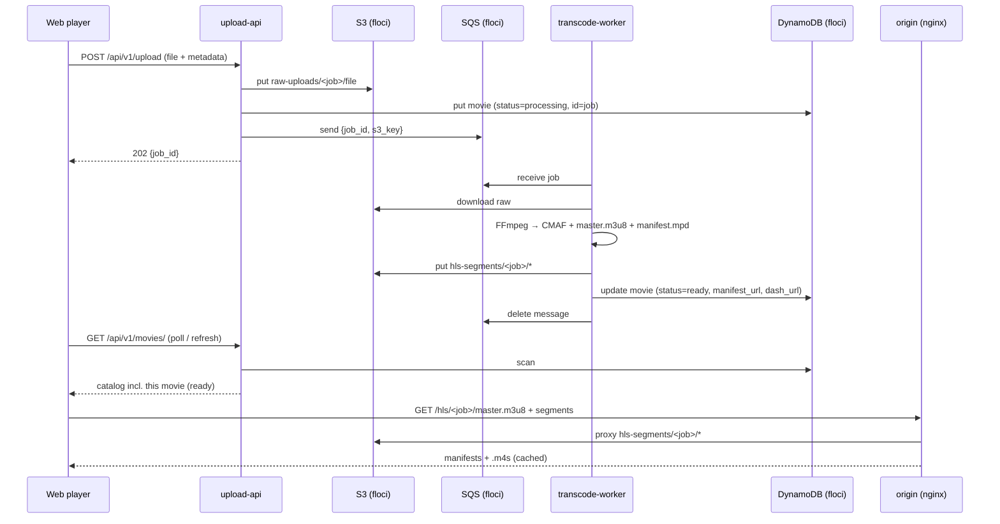

# Application Design — Navifly / StreamSRE

The complete design of the mini video-streaming platform: what it is, the
principles behind it, the components, the data model, the end-to-end flows, the
infrastructure, and the key decisions with their trade-offs.

Companion docs: [architecture.md](architecture.md) (diagram + components),
[api-structure.md](api-structure.md) (endpoints), [infra-floci.md](infra-floci.md)
(Terraform + floci), [database.md](database.md) (catalog usage),
[product.md](product.md) (product tour).

---

## 1. What it is

An OTT-style (Netflix / Apple TV) video platform that takes a raw upload,
transcodes it to **adaptive-bitrate HLS and DASH**, and streams it through an
Apple-TV–style web player — wrapped in a full **SRE** story (observability,
SLOs, runbooks, chaos). Everything runs locally at zero cost: AWS is emulated by
**floci**, and infrastructure is real Terraform.

### Goals

- Demonstrate the **end-to-end video delivery path**: upload → transcode →
  package → origin → player.
- Prove **cloud + IaC** fluency (S3 / SQS / DynamoDB via Terraform) without a
  cloud bill.
- Show **SRE maturity**: metrics, SLOs, burn-rate alerts, runbooks, chaos.
- Be honest: emulate where emulation is faithful (S3/SQS/DynamoDB wire
  protocol), document where it isn't (CDN, edge firewall).

### Non-goals

- Low-Latency HLS (documented as future work — real edge-case complexity).
- DRM / licensing.
- Real FortiGate hardware (documented placement only — see infra docs).

---

## 2. Design principles

1. **Package once, serve many.** A single FFmpeg pass emits CMAF (fMP4) segments
   plus **both** an HLS master and a DASH manifest that reference the *same*
   segments — no second transcode for DASH.
2. **Same code, any AWS.** Services use plain `boto3`; only the endpoint changes
   between floci and real AWS. Terraform is identical modulo the provider block.
3. **Self-healing dev.** Terraform is the "proper" provisioning path, but every
   service **lazily creates** its S3 bucket / SQS queue / DynamoDB table on first
   use, so the stack runs even if `terraform apply` is skipped.
4. **Stateless where possible.** Job status is derived from S3 (does
   `master.m3u8` exist?) rather than a separate state store; the catalog holds
   durable metadata.
5. **Observability is not an afterthought.** Every service exposes Prometheus
   metrics; QoE is a first-class signal.

---

## 3. Components

See [architecture.md](architecture.md) for the diagram and the full table.
In one line each:

- **frontend** — Next.js Apple-TV UI (hls.js), upload + browse + player.
- **upload-api** — FastAPI: ingest, catalog (DynamoDB), job status.
- **transcode-worker** — SQS consumer; FFmpeg → CMAF + HLS + DASH → S3.
- **origin** — Nginx proxy/cache in front of the S3 segments bucket.
- **beacon-collector** — FastAPI: QoE events → Prometheus.
- **observability** — Prometheus + Grafana + Alertmanager.
- **floci** — local AWS emulator (S3, SQS, DynamoDB) on `:4566`.

---

## 4. Data model

### 4.1 Object storage (S3)

```
streamsre-raw-uploads/
  <job_id>/<original-filename>          # raw upload

streamsre-hls-segments/
  <job_id>/master.m3u8                  # HLS master
  <job_id>/media_0.m3u8 …               # per-rendition HLS media playlists
  <job_id>/manifest.mpd                 # DASH manifest (same segments)
  <job_id>/init-stream0.m4s …           # CMAF init segments
  <job_id>/chunk-stream0-00001.m4s …    # CMAF media segments
```

### 4.2 Catalog (DynamoDB — `streamsre-catalog`)

Single-table, partition key `id` (string). Chosen as the AWS-native,
Cassandra-lineage NoSQL store; access patterns are simple enough that a scan +
in-memory sort covers listing (a GSI on `genre`/`tag` is the scale-up path).

| Attribute | Type | Notes |
|---|---|---|
| `id` (PK) | S | equals `job_id` for pipeline uploads |
| `title`, `genre`, `rating` | S | |
| `year` | N | |
| `description`, `duration`, `tag` | S | optional |
| `status` | S | `processing` → `ready` |
| `manifest_url`, `dash_url` | S | set when the worker finishes |
| `created_at` | S | ISO-8601 |

### 4.3 Queue message (SQS — `streamsre-transcode-queue`)

```json
{
  "job_id": "b1c2...",
  "s3_key": "b1c2.../movie.mp4",
  "filename": "movie.mp4",
  "profiles": ["360p", "720p", "1080p"],
  "created_at": "2026-07-19T12:00:00Z"
}
```

A dead-letter queue (`streamsre-transcode-dlq`, `maxReceiveCount=3`) captures
poison jobs.

---

## 5. End-to-end flow



---

## 6. Streaming / packaging design

- **ABR ladder**: 360p (800 kbps) / 720p (2500 kbps) / 1080p (5000 kbps),
  H.264 (`libx264`), AAC audio, forced `yuv420p` for universal decode.
- **Segments**: 6-second CMAF (fMP4) with keyframes aligned to segment
  boundaries (`-force_key_frames`), so every rendition cuts at the same points.
- **One pass, two protocols**: FFmpeg's `dash` muxer writes `manifest.mpd`;
  `-hls_playlist 1` additionally writes `master.m3u8` + media playlists that
  reference the **same** `.m4s` segments. This is the whole reason DASH is
  "free" here.
- **Playback**: hls.js (or native HLS on Safari/iOS) for `.m3u8`; any DASH
  player can consume `manifest.mpd`. The player picks renditions adaptively.

---

## 7. Infrastructure & networking

- **floci** (`~/floci-stack`) is the local AWS emulator on `:4566` — real AWS
  wire protocol, so `boto3`/`aws`/Terraform work unchanged.
- **Terraform** (`infra/terraform`) provisions only what the app uses — two S3
  buckets, the SQS queue + DLQ, and the DynamoDB table — with a floci-targeted
  provider (path-style, dummy creds, `:4566` endpoints). No VPC module (floci
  has no network plane to secure; that design is documented, not provisioned).
- **Networking**: containers reach floci via `host.docker.internal:4566`
  (`extra_hosts: host-gateway`); host tools use `localhost:4566`. Stored
  `manifest_url`s use the browser-facing origin (`localhost:8080`).

Full detail and the real-AWS mapping: [infra-floci.md](infra-floci.md).

---

## 8. Observability & SLOs

- **Metrics**: request rate/latency/in-progress (upload-api), transcode job
  duration + queue depth + segments uploaded (worker), QoE histograms/counters
  (beacon), nginx stub status (origin).
- **SLIs/SLOs**: manifest & segment availability + latency; transcode success
  rate; QoE startup P95 and rebuffer ratio.
- **Alerts**: multi-window burn-rate (fast 1h/6h, slow) in
  `observability/prometheus/rules`; routed via Alertmanager.
- **Runbooks** (`runbooks/`) + **chaos** (`chaos/`) close the loop: an
  experiment that kills the origin or injects latency should trip the alerts and
  visibly burn the error budget.

---

## 9. Security

- **Upload validation**: extension allow-list, magic-byte sniffing, size cap
  (500 MB), request-body size middleware, simple rate limiting.
- **Origin headers**: CORS, HSTS, `X-Frame-Options`, `X-Content-Type-Options`.
- **Least privilege (design)**: upload-api only `SendMessage`; worker only
  `Receive`/`Delete`; origin is the only reader of the segments bucket — maps to
  IAM policies on real AWS.
- **Secrets**: `.env` is git-ignored; only dummy floci creds are committed via
  `.env.example`. Image + secret scanning in `security/`.
- **Edge firewall / VPN**: documented placement (FortiGate/WAF, VPN-restricted
  admin) rather than faked — see infra docs.

---

## 10. Key decisions & trade-offs

| Decision | Why | Trade-off |
|---|---|---|
| **DynamoDB** for the catalog | AWS-native NoSQL, Dynamo/Cassandra lineage, floci-supported, Terraform-provisioned | No rich SQL joins; listing uses scan (fine at this scale) |
| **floci** over LocalStack | User's own emulator; same `:4566` + wire protocol | External stack to start; API-compatible with LocalStack |
| **CMAF once → HLS + DASH** | One encode serves both protocols | Assumes an audio stream; single-audio ladder |
| **fMP4 (`.m4s`)** not MPEG-TS | CMAF enables the dual-manifest trick; modern | (Also why `*.ts` was removed from `.gitignore` — it collided with TypeScript) |
| **Job status from S3** | Stateless, no extra store | Binary (processing/complete); no fine-grained progress |
| **Nginx origin** stands in for CDN | Shows caching/edge behavior locally | Not a real global CDN; documented as CloudFront in prod |
| **Terraform + lazy self-create** | IaC story *and* frictionless dev | Two provisioning paths to keep consistent |

---

## 11. Repository layout

```
video-streaming-sre/
  frontend/            # Next.js Apple-TV UI (hls.js player)
  services/
    upload-api/        # FastAPI: ingest + catalog (DynamoDB) + job status
    transcode-worker/  # FFmpeg → CMAF + HLS + DASH
    origin/            # Nginx origin/cache
    beacon-collector/  # QoE ingest → Prometheus
  infra/terraform/     # S3 + SQS + DynamoDB, floci-targeted
  observability/       # Prometheus, Grafana, Alertmanager
  slo/ runbooks/ chaos/# SRE artifacts
  security/            # image + secret scans
  docs/                # this documentation
  start.sh / stop.sh   # one-command bring-up / teardown
  docker-compose.yml
```

---

## 12. Running it

```bash
./start.sh            # floci → terraform → services   (add --seed for a demo clip)
# open http://localhost:3001  → Upload a file → it transcodes → appears → streams
./stop.sh             # stop services   (./stop.sh --all also stops floci)
```

Or use the Makefile targets (`make bootstrap`, `make up`, `make demo`). See the
[README](../README.md) and [infra-floci.md](infra-floci.md).

---

## 13. Future work

- Low-Latency HLS (partial segments, blocking playlist reload).
- DynamoDB GSI for genre/tag queries + pagination; thumbnails/artwork.
- Signed playback tokens (JWT) checked at the origin.
- Kubernetes (Helm + `kind`) deployment; CI/CD deploy stage.
- WebRTC live-preview module.
